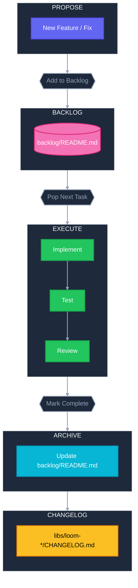

# Loom Development Workflow

## Backlog Lifecycle



## Structure

```
libs/
├── loom-assert/
│   ├── CHANGELOG.md
│   └── ...
├── loom-cli/
│   ├── CHANGELOG.md
│   └── ...
├── loom-codec/
│   ├── CHANGELOG.md
│   └── ...
├── loom-config/
│   ├── CHANGELOG.md
│   └── ...
├── loom-core/
│   ├── CHANGELOG.md
│   └── ...
├── loom-cortex/
│   ├── CHANGELOG.md
│   └── ...
├── loom-error/
│   ├── CHANGELOG.md
│   └── ...
├── loom-eval/
│   └── ...
├── loom-io/
│   ├── CHANGELOG.md
│   └── ...
├── loom-pipe/
│   ├── CHANGELOG.md
│   └── ...
├── loom-runtime/
│   ├── CHANGELOG.md
│   └── ...
├── loom-signal/
│   ├── CHANGELOG.md
│   └── ...
├── loom-sync/
│   ├── CHANGELOG.md
│   └── ...
└── loom/
    ├── CHANGELOG.md
    └── ...

backlog/
└── README.md                  ← Completed work summary
```

## Workflow Rules

| Rule | Description |
|------|-------------|
| **Backlog** | New work items are added to `backlog/README.md` |
| **Execute** | Pick next task, implement, test, review |
| **Complete** | Update `backlog/README.md` with summary of completed work |
| **Changelog** | Update affected `libs/*/CHANGELOG.md` files |

## Current Stack

All previously planned phases have been completed. The backlog is empty.

## Crate Changelogs

Each crate maintains its own `CHANGELOG.md`:

| Crate | Recent Changes |
|-------|----------------|
| `loom-error` | Serde support for `Error` and `ErrorCode` |
| `loom-runtime` | Pipeline<RunContext> architecture, execute(), RunContext, removed eval module |
| `loom-pipe` | LayerContext trait, Layer trait with associated Input type, Pipeline<C>, PipelineBuilder<C> |
| `loom-eval` | New crate: EvalLayer, EvalConfig, EvalOutput, EvalResult, Score->Eval rename |
| `loom-config` | Multi-file config merge ($include), config integration, validation |
| `loom-cli` | Simplified to `run` command only |
| `loom-assert` | -- |
| `loom-codec` | -- |
| `loom-core` | -- |
| `loom-cortex` | -- |
| `loom-io` | -- |
| `loom-signal` | -- |
| `loom-sync` | -- |
| `loom` | -- |

## Completed Work

Phases removed from stack after completion (also recorded in crate changelogs):

- **Context Refactor** - Context as active runtime client, BatchContext for batch processing
- **Multi-File Config Merge** - $include directive for config composition
- **Time Operators** - Timeout, delay
- **Sequence Operators** - Flatten, flat_map, chunk, window, concat
- **Control Flow & Result Ops** - Branch, and/or, retry, unwrap/expect operators
- **Error Aggregation** - `loom_error::Result<Value>` in `LayerResult`
- **Config Integration** - `loom-config` crate with env var support
- **Pipeline Rewrite** - Layer trait infrastructure
- **Fork/Join** - Renamed spawn->fork, added `.join()`
- **Result Metadata** - Timing metrics (`elapsed_ms`, `throughput`)
- **Eval Extraction** - Created `loom-eval` crate, Score->Eval rename
- **Runtime Simplification** - Pipeline<RunContext>, execute(), removed eval module
- **CLI Cleanup** - Removed validate, score, train commands
