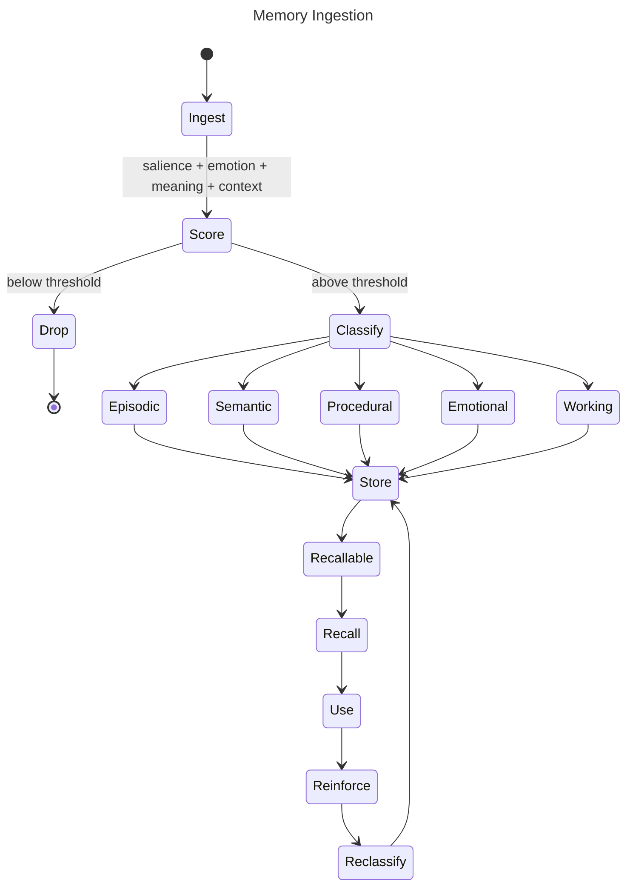

```mermaid
---
title: Memory Ingestion
---

stateDiagram-v2
  direction TB

  [*] --> Ingest

  Ingest --> Score : salience + emotion + meaning + context
  Score --> Drop : below threshold
  Drop --> [*]

  Score --> Classify : above threshold
  Classify --> Episodic
  Classify --> Semantic
  Classify --> Procedural
  Classify --> Emotional
  Classify --> Working

  Episodic --> Store
  Semantic --> Store
  Procedural --> Store
  Emotional --> Store
  Working --> Store

  Store --> Recallable

  Recallable --> Recall
  Recall --> Use
  Use --> Reinforce
  Reinforce --> Reclassify
  Reclassify --> Store
```