# 6.1.2 Hybrid Algorithm

<pre>
├── <a href="../README.md">..</a>
├── <a href="../1.memory.md">▸ 1. Memory</a>
├── <a href="../2.ingestion.md">▸ 2. Ingestion</a>
├── <a href="../3.guards.md">▸ 3. Guards</a>
├── <a href="../4.recall.md">▸ 4. Recall</a>
├── <a href="../5.classification.md">▸ 5. Classification</a>
└── <a href="../README.md">▾ 6. Research/</a>
    ├── <a href="./README.md">▾ 6.1 Loom/</a>
    │   ├── <a href="./scoring-algorithm.md">6.1.1 Eval Algorithm</a>
    │   └── <a href="./hybrid-algorithm.md"><b>6.1.2 Hybrid Algorithm</b></a> 👈
    ├── <a href="../reference/README.md">▸ 6.2 Reference/</a>
    └── <a href="../analysis/README.md">▸ 6.3 Analysis/</a>
</pre>

A **hybrid evaluation strategy** that pairs a fast local classifier with selective LLM judging — maximizing speed and cost efficiency while preserving quality on the hardest cases.

---

## At a Glance

| Dimension | Local Model (NLI / STS / Classifier) | LLM Judge (API) |
|-----------|--------------------------------------|-----------------|
| **Latency per eval** | ~0.0006 s (cross-encoder) / ~0.00006 s (bi-encoder) | ~2.9 s |
| **Throughput** | ~1,800 docs/s (cross-encoder) / ~18,000 q/s (bi-encoder) on V100 | ~0.34 eval/s |
| **Cost per eval** | ~$0.0000005 | ~$0.0032 |
| **Cost per 10k evals** | ~$0.005 | ~$32.00 |
| **Accuracy vs humans** | BERTScore avg Spearman ρ ≈ 0.225 (SummEval) | G-EVAL (GPT-4) avg Spearman ρ ≈ 0.514 (SummEval) |
| **Model size** | 22.7M params (MiniLM) | 70B params (Llama 3.1) / opaque (API) |
| **Nuance** | Good on trained distribution | Excellent on edge cases |
| **Explainability** | Calibrated numeric scores | Natural-language rationales |
| **Reproducibility** | Deterministic | Nondeterministic (even at T=0) |
| **Role** | Handles the bulk (~95%+ of traffic) | Handles the exceptions |

> **Bottom line:** Local models are **~5,200× faster** and **~6,800× cheaper** per eval, but LLM judges correlate **~128% better** with human judgments on open-ended criteria.

---

## Research Basis

The hybrid approach is grounded in a core tradeoff between two evaluation families:

| Family | Description | Typical Models |
|--------|-------------|----------------|
| **LLM-as-Judge** | Evaluation formulated as a language task — judge receives input, candidate, rubric, and returns scores/preferences/critiques | GPT-4, Claude Opus, Llama 3.1 70B |
| **Local NLI / STS** | Encoder-based models producing entailment scores, similarity embeddings, or cross-encoder relevance scores | DeBERTa, RoBERTa, SBERT, SimCSE, MiniLM |

### Representative Models

| Category | Models | Params | Throughput | Strengths | Weaknesses |
|----------|--------|--------|------------|-----------|------------|
| **LLM Judge (API)** | GPT-4, Claude Opus | Opaque | Token-based; TTFT ~15 s at 128k ctx | Highest flexibility; rubric-based; reference-free; can explain | Prompt sensitivity; bias; nondeterminism; cost; drift |
| **LLM Judge (hosted)** | Llama 2 (4k ctx), Llama 3 (8k), Llama 3.1 (128k) | 70B | vLLM: 2–4× throughput via PagedAttention | Data control; reproducibility; offline | High infra burden; GPU memory; still exhibits judge biases |
| **Local STS (bi-encoder)** | SBERT, SimCSE, MiniLM embeddings | 22–110M | ~18,000 q/s (V100), ~750 q/s (CPU) | Extremely fast; cacheable; reproducible; offline | Needs references; similarity ≠ correctness; weak on style |
| **Local NLI / cross-encoder** | DeBERTa, RoBERTa, MiniLM cross-encoder | 22–350M | ~1,800 docs/s (MiniLM-L6) | Strong for factual consistency / constraint checks | Granularity mismatch; adversarial brittleness; needs claim extraction |

### Key Accuracy Findings

> G-EVAL (GPT-4) in purple; BERTScore baseline in blue. LLM judges achieve **+128% higher Spearman** and **+139% higher Kendall** correlation with human ratings on SummEval summarization dimensions.

Additional accuracy references:
- **Pairwise preference:** LLM judges (GPT-4-class) achieve **>80% agreement** with human preferences, comparable to inter-human agreement
- **SimCSE** (supervised BERT-base): avg Spearman **~81.6%** on STS benchmark tasks
- **Length-controlled AlpacaEval:** debiasing improves Chatbot Arena correlation from Spearman **0.94 → 0.98**
- **DeBERTa:** +0.9% over RoBERTa-Large on MNLI (90.2% → 91.1%)

### Meta-Evaluation Benchmarks

| Benchmark | Type | What It Measures |
|-----------|------|------------------|
| **SummEval** | Summarization | Coherence, consistency, fluency, relevance (human ratings) |
| **MT-Bench / Chatbot Arena** | Chat assistant | Preference-based pairwise evaluation vs human judges |
| **WMT Metrics Shared Tasks** | Machine translation | Metric correlation with MQM-based human judgments |
| **HELM** | Multi-scenario | Accuracy, calibration, robustness, fairness, efficiency |
| **MNLI** | NLI | Entailment model training and evaluation |
| **ANLI** | NLI (adversarial) | Stress-testing NLI beyond dataset artifacts |
| **STS-B** | Semantic similarity | Core sentence similarity scoring (part of GLUE) |

---

## What "Hybrid" Means

Use a **fast, local, deterministic model** (NLI / zero-shot / STS / small classifier) to make *most* decisions, and only **escalate uncertain or high-impact cases** to an LLM-as-a-judge.

**The local model provides:**

* Cheap first-pass scoring
* Calibrated confidence
* Guardrails + routing signals

**The LLM provides:**

* Higher recall on nuanced cases
* Better handling of ambiguity and rubric interpretation
* Richer rationales (optional) for debugging / audit

---

## End-to-End Flow

> **Key idea:** Most traffic ends at **E** (local accept), not **F** (LLM escalation).

---

## The Gating Logic

You don't escalate because the local model is "bad" — you escalate because the case is **uncertain**, **disagreeing**, or **expensive to be wrong**.

### Practical Escalation Triggers

| Trigger | Description | Example |
|---------|-------------|---------|
| **Low margin** | Gap between top two labels is below δ | `top1 - top2 < 0.05` |
| **High entropy** | Probability mass spread across many labels | No single label dominates |
| **Conflicting signals** | Categories disagree with each other | Sentiment = positive but "punishment" is high |
| **Category-specific risk** | Some categories are costlier to misjudge | Safety-related labels |
| **OOD indicators** | Input looks unusual for the model | Very long, very short, multilingual, unusual tokens |

---

## Scoring + Thresholds Pattern

This pattern maps directly onto Loom's weighted-label config (`labels[i].weight`, `labels[i].threshold`, optional Platt calibration).

```mermaid
flowchart TD
    A["Raw model probs<br/>p(label ∣ text)"] --> B["Calibrate<br/>p′ = σ(a · logit(p) + b)"]
    B --> C["Apply label thresholds<br/>pass_i = p′ ≥ thr_i"]
    C --> D["Weighted aggregation<br/>score = Σ weight_i · p′_i"]
    D --> E{"Decision gate"}
    E -->|"score ≥ global_thr<br/>and high confidence"| F["Accept"]
    E -->|"otherwise"| G["Escalate to LLM"]

    style B fill:#3b82f6,color:#fff
    style E fill:#f59e0b,color:#fff
    style F fill:#22c55e,color:#fff
    style G fill:#ef4444,color:#fff
```

> **Tip:** Use calibrated probabilities (p′) for gating decisions; use the **weighted score** for ranking and final verdicts.

---

## Reconciling Local vs LLM Outputs

When you escalate, deterministic reconciliation rules keep the system stable and debuggable.

### Reconciliation Rules

| Condition | Action |
|-----------|--------|
| Local confidence **high** | Keep local — don't call LLM at all |
| Local confidence **low** | Trust LLM verdict |
| High-stakes + **disagreement** | Adjudicate (second judge, stricter prompt, or human) |

---

## Backpressure / Cost Control Loop

Hybrid only works at scale if LLM calls stay bounded.

### Strategies for Staying Within Budget

| Strategy | How It Works |
|----------|--------------|
| **Dynamic δ** | Tighten the "uncertain" band when load is high |
| **Per-category budgets** | Only "hard" categories get LLM access |
| **Sampling for drift detection** | LLM judges a sample of "easy" cases to detect model drift |

---

## Known Biases and Failure Modes

### LLM Judge Biases

| Bias | Description | Mitigation |
|------|-------------|------------|
| **Position bias** | Favors the first or second option in pairwise comparisons | Randomize order; average both directions; track preference fairness |
| **Length / verbosity bias** | Prefers longer, more verbose responses regardless of quality | Length-controlled scoring (LC-AlpacaEval improved Spearman 0.94 → 0.98); regression debiasing |
| **Prompt sensitivity** | Small prompt changes cause large score shifts | Structured form-filling; explicit rubric criteria; chain-of-thought |
| **Nondeterminism** | Outputs vary even at temperature = 0 (implementation-level factors) | Multi-run judging; track stability metrics; store raw responses |
| **Model drift** | API providers silently update weights and safety layers | Pin model versions; run canary suites; store model version IDs |

### Local Model Failure Modes

| Failure Mode | Description | Mitigation |
|--------------|-------------|------------|
| **Semantic overlap ≠ correctness** | High similarity despite factual errors, negation flips, or missing constraints | Pair STS with NLI entailment checks; don't rely on similarity alone |
| **Granularity mismatch** | Sentence-level NLI models applied to document-level input lose context | Segment + aggregate (SummaC pattern); use doc-aware models when available |
| **Adversarial brittleness** | NLI models overfit dataset artifacts; break on adversarial inputs | Test on ANLI-style stress tests; don't treat raw entailment as ground truth |
| **Domain shift** | Performance degrades on unseen domains or writing styles | Monitor per-domain accuracy; calibrate thresholds per domain; periodic retraining |

---

## Decision Criteria by Use Case

| Use Case | Recommended Approach | Rationale |
|----------|---------------------|-----------|
| **High-stakes** (safety, compliance, medical/legal) | Local NLI/STS + evidence-grounded checks + human escalation | Evaluator hallucination is itself a safety risk; LLM judges only with strict logging and conservative gating |
| **Low-latency CI** (nightly regressions, test suites at scale) | Local models dominant; LLM judges on 0.1–1% sample | Throughput is the binding constraint; use LLM sample to detect drift |
| **Budget-constrained** | Local NLI/STS almost always wins on unit cost | At ~$0.005 per 10k evals vs ~$32, local is ~6,800× cheaper; use batch/async API modes if LLM needed |
| **Reference-free** (helpfulness, style, reasoning quality) | LLM judges are the most direct option | NLI/STS are not well-defined without references; G-EVAL shows +128% accuracy gain over similarity metrics |

---

## Engineering Considerations

### Versioning and Drift

LLM judges drift by default — API providers update weights, system behavior, and safety layers silently. For every evaluation, store:

| Artifact | Why |
|----------|-----|
| Exact judge prompt template | Prompt changes = different evaluator |
| Model version identifier | Detect silent model updates |
| Decoding parameters (temp, top-p) | Reproducibility baseline |
| Raw judge response | Audit trail; re-parsing |
| Parsing logic version | Output schema changes break pipelines |

Run a fixed **canary suite** (gold-labeled examples) whenever any component changes. Track score distributions over time.

### Prompt Engineering for Judges

| Practice | Effect |
|----------|--------|
| **Structured form-filling** | Explicit fields for scores reduce ties and improve calibration (G-EVAL pattern) |
| **Order randomization** | Mitigates position bias in pairwise comparisons |
| **Multi-run averaging** | Reduces variance from nondeterminism; tracks stability |
| **Tie reduction** | Probability-weighted scoring avoids inflated Kendall τ from discrete outputs |

### Privacy, Data Residency, and Offline Capability

| Requirement | Solution |
|-------------|----------|
| **Offline / air-gapped** | Local NLI/STS only (no external API calls) |
| **Data residency** | Self-hosted open LLM judges (Llama class) keep data in your environment |
| **Privacy-sensitive data** | Local models by default; API judges require governance review |
| **Middle ground** | Hosted open LLMs: LLM-level rubric interpretation + data control, at cost of GPU footprint |

---

## Performance Benchmarks

### Accuracy: LLM Judge vs Local Baseline

> Purple = G-EVAL (GPT-4); Blue = BERTScore. The LLM judge achieves **+128%** higher Spearman and **+139%** higher Kendall correlation with human ratings.

### Throughput: Evals per Second

> Local bi-encoders are **~53,000×** faster than API-based LLM judges. Even the slower cross-encoder is **~5,300×** faster.

### Cost: Per 10,000 Evaluations

```mermaid
xychart-beta
    title "Cost per 10k evaluations (USD — lower is better)"
    x-axis ["Local (cross-encoder)", "LLM Judge (GPT-4.1 API)"]
    y-axis "USD" 0 --> 35
    bar [0.005, 32.00]
```

> LLM judge costs **~$32** per 10k evals vs **~$0.005** for local — a **6,800× difference**.

### Model Size

> The self-hosted LLM judge requires **~3,084×** more parameters than the local cross-encoder.

### Full Metrics Comparison

> **Reference workload:** 1 eval = 800 input tokens + 200 output tokens (LLM) or 1 pairwise cross-encoder score (local). LLM pricing: GPT-4.1 at $2/1M input + $8/1M output. Local GPU cost: V100-backed instance at ~$3.06/hr.

| Metric | LLM Judge (GPT-4.1 API) | Local (MiniLM Cross-Encoder) | Difference |
|--------|------------------------:|-----------------------------:|-----------:|
| **Accuracy — Spearman ρ** (SummEval) | 0.514 | 0.225 (BERTScore) | **+128%** higher (LLM) |
| **Accuracy — Kendall τ** (SummEval) | 0.418 | 0.175 (BERTScore) | **+139%** higher (LLM) |
| **Latency per eval** | ~2.92 s | ~0.00056 s | **~5,200×** slower (LLM) |
| **Throughput** (evals/sec) | ~0.34 | ~1,800 | **~5,300×** lower (LLM) |
| **Cost per eval** | $0.0032 | $0.0000005 | **~6,800×** more expensive (LLM) |
| **Cost per 10k evals** | ~$32.00 | ~$0.005 | **~6,800×** more expensive (LLM) |
| **Model parameters** | 70B (Llama 3.1, if self-hosted) | 22.7M (MiniLM) | **~3,084×** larger (LLM) |
| **Context capacity** | 128k tokens (Llama 3.1) | ~256 wordpieces (typical) | LLM handles long docs; local truncates |
| **TTFT at 128k context** | ~15 s | N/A | Long-context judging is slow |
| **ONNX optimization speedup** | N/A | ~1.83× (GPU) / ~3.08× (CPU) | Further throughput gains available |

### API Pricing Reference

| Provider | Model | Input | Output |
|----------|-------|------:|-------:|
| OpenAI | GPT-4.1 | $2.00 / 1M tokens | $8.00 / 1M tokens |
| Anthropic | Claude Opus | $5.00 / 1M tokens | $25.00 / 1M tokens |

---

## Why Hybrid Is Usually the Best Default

| Benefit | Explanation |
|---------|-------------|
| **Speed & cost** | Local model handles the bulk of traffic at near-zero cost |
| **Quality where it matters** | LLM handles edge cases with higher recall and nuance |
| **Operational control** | Budgets + rate limiting are straightforward to implement |
| **Continuous improvement** | LLM decisions become training / calibration data for the local gate |

---

## Implementation Path

The hybrid approach maps naturally onto Loom's `loom-pipe` trait system:

| Hybrid Concept | Loom Mapping |
|----------------|--------------|
| Local Scorer | `Layer` (e.g., `EvalLayer` with zero-shot classification) |
| Confidence Gate | Post-processing logic within a `Layer` or between layers |
| LLM Judge | A second `Layer` wrapping an LLM API client |
| Reconciler | A final `Layer` that merges local + LLM signals |
| Budget Controller | Configurable via `loom-config` sections |

See the [Eval Algorithm](./scoring-algorithm.md) for the current local scoring implementation.
