# 6.1.1 Eval Algorithm

<pre>
├── <a href="../README.md">..</a>
├── <a href="../1.memory.md">▸ 1. Memory</a>
├── <a href="../2.ingestion.md">▸ 2. Ingestion</a>
├── <a href="../3.guards.md">▸ 3. Guards</a>
├── <a href="../4.recall.md">▸ 4. Recall</a>
├── <a href="../5.classification.md">▸ 5. Classification</a>
└── <a href="../README.md">▾ 6. Research/</a>
    ├── <a href="./README.md">▾ 6.1 Loom/</a>
    │   ├── <a href="./scoring-algorithm.md"><b>▾ 6.1.1 Eval Algorithm</b></a> 👈
    │   │   ├── <a href="#overview">Overview</a>
    │   │   ├── <a href="#data-flow">Data Flow</a>
    │   │   ├── <a href="#mathematical-definitions">▾ Mathematical Definitions</a>
    │   │   │   ├── <a href="#platt-calibration">Platt Calibration</a>
    │   │   │   ├── <a href="#label-score">Label Score</a>
    │   │   │   ├── <a href="#category-score">Category Score</a>
    │   │   │   └── <a href="#overall-score">Overall Score</a>
    │   │   ├── <a href="#label-categories">▾ Label Categories</a>
    │   │   │   ├── <a href="#sentiment-3-labels">Sentiment</a>
    │   │   │   ├── <a href="#emotion-7-labels">Emotion</a>
    │   │   │   ├── <a href="#outcome-7-labels">Outcome</a>
    │   │   │   ├── <a href="#context-6-labels">Context</a>
    │   │   │   ├── <a href="#task-4-labels">Task</a>
    │   │   │   └── <a href="#conversational-10-labels">Conversational</a>
    │   │   ├── <a href="#rejection-criteria">Rejection Criteria</a>
    │   │   ├── <a href="#dynamic-thresholds">Dynamic Thresholds</a>
    │   │   ├── <a href="#weight-design-rationale">Weight Design Rationale</a>
    │   │   └── <a href="#example-scoring">▾ Example Scoring</a>
    │   │       ├── <a href="#example-1-accepted">Example 1: Accepted</a>
    │   │       └── <a href="#example-2-rejected">Example 2: Rejected</a>
    │   └── <a href="./hybrid-algorithm.md">6.1.2 Hybrid Algorithm</a>
    ├── <a href="../reference/README.md">▸ 6.2 Reference/</a>
    └── <a href="../analysis/README.md">▸ 6.3 Analysis/</a>
</pre>

A multi-dimensional text classification system for determining text importance and filtering trivial content.

## Overview

The scoring algorithm evaluates input text across six independent dimensions using zero-shot classification, then aggregates weighted predictions to produce a final importance score. Raw model confidences are calibrated via Platt scaling before scoring. Text that scores below a dynamic threshold or is detected as phatic (small talk) is rejected.

## Data Flow

## Mathematical Definitions

### Platt Calibration

Before scoring, raw model confidence values are calibrated using Platt scaling (a sigmoid transform). This maps raw scores into well-calibrated probabilities.

Where:
- `c` = raw model confidence (0.0 to 1.0)
- `a` = Platt scaling parameter A (per label, default 1.0)
- `b` = Platt scaling parameter B (per label, default 0.0)
- `c'` = calibrated confidence (0.0 to 1.0)

With identity parameters (`a = 1.0`, `b = 0.0`), calibration is skipped and the raw score passes through unchanged. Custom `a` and `b` values per label allow fine-tuning the confidence curve when the model is over- or under-confident for specific labels.

### Label Score

For each label prediction from the model:

Where:
- `c` = raw model confidence (0.0 to 1.0)
- `c'` = calibrated confidence via Platt scaling
- `a` = Platt scaling parameter A (per label, default 1.0)
- `b` = Platt scaling parameter B (per label, default 0.0)
- `w` = label weight (predefined per label)
- `t` = label threshold (predefined per label)

### Category Score

Each category aggregates its top-k label scores:

Where:
- `k = min(2, n)` where n = number of labels with non-zero scores
- Labels are sorted in descending order by score
- k is at least 1 to avoid division by zero

### Overall Score

The final score is the maximum across all categories:

## Label Categories

### Sentiment (3 labels)

| Label    | Weight | Threshold | Platt A | Platt B | Hypothesis                                                                       |
|----------|--------|-----------|---------|---------|----------------------------------------------------------------------------------|
| Positive | 0.30   | 0.70      | 1.0     | 0.0     | "The speaker is expressing a positive, happy, or optimistic sentiment."           |
| Negative | 0.35   | 0.70      | 1.0     | 0.0     | "The speaker is expressing a negative, unhappy, or pessimistic sentiment."        |
| Neutral  | 0.10   | 0.70      | 1.0     | 0.0     | "The speaker is expressing a neutral or matter-of-fact sentiment without strong emotion." |

### Emotion (7 labels)

| Label  | Weight | Threshold | Platt A | Platt B | Hypothesis                                                                    |
|--------|--------|-----------|---------|---------|-------------------------------------------------------------------------------|
| Stress | 0.45   | 0.70      | 1.0     | 0.0     | "The speaker is feeling stressed, overwhelmed, or under pressure."            |
| Fear   | 0.40   | 0.70      | 1.0     | 0.0     | "The speaker is feeling afraid, anxious, or worried about something."         |
| Anger  | 0.40   | 0.70      | 1.0     | 0.0     | "The speaker is feeling angry, frustrated, or irritated about something."     |
| Sad    | 0.40   | 0.70      | 1.0     | 0.0     | "The speaker is feeling sad, upset, or grieving about something."             |
| Shame  | 0.35   | 0.70      | 1.0     | 0.0     | "The speaker is feeling ashamed, embarrassed, or guilty about something."     |
| Pride  | 0.30   | 0.70      | 1.0     | 0.0     | "The speaker is feeling proud, accomplished, or satisfied with an achievement." |
| Joy    | 0.30   | 0.70      | 1.0     | 0.0     | "The speaker is feeling joyful, happy, or excited about something."           |

### Outcome (7 labels)

| Label      | Weight | Threshold | Platt A | Platt B | Hypothesis                                                                               |
|------------|--------|-----------|---------|---------|------------------------------------------------------------------------------------------|
| Decision   | 0.80   | 0.70      | 1.0     | 0.0     | "The speaker has made or is announcing a decision or choice."                            |
| Progress   | 0.65   | 0.70      | 1.0     | 0.0     | "The speaker is describing progress, completion, or forward movement on something."      |
| Conflict   | 0.65   | 0.70      | 1.0     | 0.0     | "The speaker is describing a disagreement, conflict, argument, or interpersonal tension." |
| Success    | 0.55   | 0.70      | 1.0     | 0.0     | "The speaker is describing a success, achievement, or accomplishment."                   |
| Failure    | 0.55   | 0.70      | 1.0     | 0.0     | "The speaker is describing a failure, setback, or something that went wrong."            |
| Reward     | 0.45   | 0.70      | 1.0     | 0.0     | "The speaker is describing receiving a reward, benefit, or positive outcome."             |
| Punishment | 0.45   | 0.70      | 1.0     | 0.0     | "The speaker is describing a punishment, penalty, or negative consequence."               |

### Context (6 labels)

| Label      | Weight | Threshold | Platt A | Platt B | Hypothesis                                                                          |
|------------|--------|-----------|---------|---------|--------------------------------------------------------------------------------------|
| Preference | 0.85   | 0.65      | 1.0     | 0.0     | "The speaker is expressing a personal preference, like, dislike, or opinion."        |
| Fact       | 0.80   | 0.70      | 1.0     | 0.0     | "The speaker is stating a factual piece of information that should be remembered."   |
| Entity     | 0.65   | 0.75      | 1.0     | 0.0     | "The speaker is mentioning a specific named person, organization, or entity."        |
| Time       | 0.55   | 0.70      | 1.0     | 0.0     | "The speaker is mentioning a specific time, date, or deadline."                      |
| Place      | 0.55   | 0.70      | 1.0     | 0.0     | "The speaker is mentioning a specific location, place, or address."                  |
| Phatic     | 0.40   | 0.80      | 1.0     | 0.0     | "This is just social pleasantry, small talk, or acknowledgment with no substantive information." |

### Task (4 labels)

| Label | Weight | Threshold | Platt A | Platt B | Hypothesis                                                                             |
|-------|--------|-----------|---------|---------|----------------------------------------------------------------------------------------|
| Task  | 1.00   | 0.65      | 1.0     | 0.0     | "The speaker is describing something they need to do, remember, or a task to complete." |
| Plan  | 0.90   | 0.65      | 1.0     | 0.0     | "The speaker is describing a plan, intention, or commitment to do something."           |
| Goal  | 0.90   | 0.65      | 1.0     | 0.0     | "The speaker is describing a goal, objective, aspiration, or something they want to achieve." |
| Time  | 0.55   | 0.70      | 1.0     | 0.0     | "The speaker is mentioning a specific time, date, or deadline."                         |

### Conversational (10 labels)

| Label               | Weight | Threshold | Platt A | Platt B | Hypothesis                                                                                                                            |
|---------------------|--------|-----------|---------|---------|---------------------------------------------------------------------------------------------------------------------------------------|
| Multi-Session       | 0.95   | 0.65      | 1.0     | 0.0     | "The speaker is referencing prior conversations, ongoing threads, or something that spans multiple sessions and should be carried forward." |
| Preference Update   | 0.90   | 0.65      | 1.0     | 0.0     | "The speaker is updating a preference or providing a new constraint that should change future responses."                              |
| Decision Commitment | 0.85   | 0.65      | 1.0     | 0.0     | "The speaker is committing to a decision, choosing between options, or confirming a direction to proceed."                             |
| Correction          | 0.85   | 0.70      | 1.0     | 0.0     | "The speaker is correcting a prior statement, fixing an error, or retracting/changing something previously said."                      |
| Unresolved          | 0.80   | 0.65      | 1.0     | 0.0     | "The speaker indicates something is unresolved, blocked, or pending and likely needs to be revisited."                                 |
| Follow-Up           | 0.80   | 0.65      | 1.0     | 0.0     | "The speaker is following up on something previously discussed, asking for continuation, refinement, or status on an existing topic."   |
| Clarification       | 0.75   | 0.70      | 1.0     | 0.0     | "The speaker is clarifying or disambiguating what they meant, correcting misunderstandings, or narrowing scope."                       |
| Instruction         | 0.75   | 0.70      | 1.0     | 0.0     | "The speaker is giving an instruction, constraint, or requirement about how to respond or what to produce."                            |
| Meta Process        | 0.60   | 0.75      | 1.0     | 0.0     | "The speaker is talking about the process of the conversation itself (format, brevity, style, structure, steps, or evaluation criteria)." |
| Question            | 0.55   | 0.70      | 1.0     | 0.0     | "The speaker is asking a question or requesting information, guidance, or an explanation."                                              |

## Rejection Criteria

Text is rejected (returns Cancel status) if **either** condition is met:

1. **Low Score:** `S_eval < T(len)` where `T` is the [dynamic threshold](#dynamic-thresholds) based on text length (default 0.75, adjusted by +/- 0.05)
2. **Phatic Detection:** `S_phatic >= 0.80`

The phatic filter ensures greetings and small talk ("hi", "thanks", "bye") are filtered out regardless of other detected signals.

## Dynamic Thresholds

The global acceptance threshold is adjusted based on input text length, acting as backpressure: shorter text gets leniency (it carries less context), while longer text must score higher to be accepted (more content should yield stronger signals).

| Text Length              | Threshold | Delta          |
|--------------------------|-----------|----------------|
| Short (<=20 chars)       | 0.70      | -0.05          |
| Medium (21-200 chars)    | 0.75      | 0 (baseline)   |
| Long (>200 chars)        | 0.80      | +0.05          |

### Modifier Configuration

| Parameter          | Default | Description                                  |
|--------------------|---------|----------------------------------------------|
| `short_text_delta` | 0.05    | Delta subtracted from baseline for short text |
| `long_text_delta`  | 0.05    | Delta added to baseline for long text         |
| `short_text_limit` | 20      | Character limit for "short" classification    |
| `long_text_limit`  | 200     | Character limit above which text is "long"    |

## Weight Design Rationale

The weight hierarchy reflects the system's optimization for capturing actionable information:

**Task labels are prioritized** because they capture the most directly actionable information:
- Task (1.00) is the highest-weighted label — explicit things to do or remember
- Plan/Goal (0.90) represent commitments and aspirations
- Time (0.55) provides supporting deadline context

**Conversational labels** capture signals that span sessions and shape future behavior:
- Multi-Session (0.95) flags cross-session continuity — the strongest conversational signal
- Preference Update (0.90) and Decision Commitment (0.85) represent durable state changes
- Correction (0.85) and Unresolved (0.80) flag items needing attention
- Meta Process (0.60) and Question (0.55) are lower — they're about the conversation, not content

**Context labels** capture factual and environmental information:
- Preference (0.85) and Fact (0.80) capture important personal information
- Entity/Time/Place (0.55-0.65) provide supporting context
- Phatic (0.40) is weighted low but has a high threshold (0.80) for rejection

**Outcome labels** capture significant life events and decisions that may be worth remembering.

**Emotion labels** weight negative emotions (stress, fear, anger) slightly higher than positive ones, as distress signals may warrant attention.

**Sentiment labels** have the lowest weights since raw sentiment provides less actionable information than the other dimensions.

## Example Scoring

### Example 1: Accepted

**Input:** "oh my god, I'm going to be late for work!"

Text length: 39 characters (medium range) — dynamic threshold is unchanged at **T = 0.75**. Platt calibration uses identity parameters (a=1.0, b=0.0), so raw scores pass through unchanged.

```mermaid
flowchart LR
    subgraph Pipeline
        R["Raw model scores"] --> P["Platt calibration<br/>(identity: a=1.0, b=0.0)"]
        P --> S["Label scoring<br/>S = c' * w if c' >= t"]
    end

    subgraph Categories
        A["Emotion<br/>Stress → ~0.45"]
        B["Task<br/>Task-like → varies"]
        C["Sentiment<br/>Negative → ~0.35"]
        D["Outcome<br/>none → 0.0"]
    end

    S --> A
    S --> B
    S --> C
    S --> D

    A --> E["max() >= T(39 chars) = 0.75"]
    B --> E
    C --> E
    D --> E

    E --> F[ACCEPT]
    style F fill:#22c55e,color:#fff
```

### Example 2: Rejected

**Input:** "hi how are you?"

Text length: 15 characters (short range) — dynamic threshold would be **T = 0.70**. However, the phatic filter (`S_phatic >= 0.80`) rejects this text regardless of the overall score.

