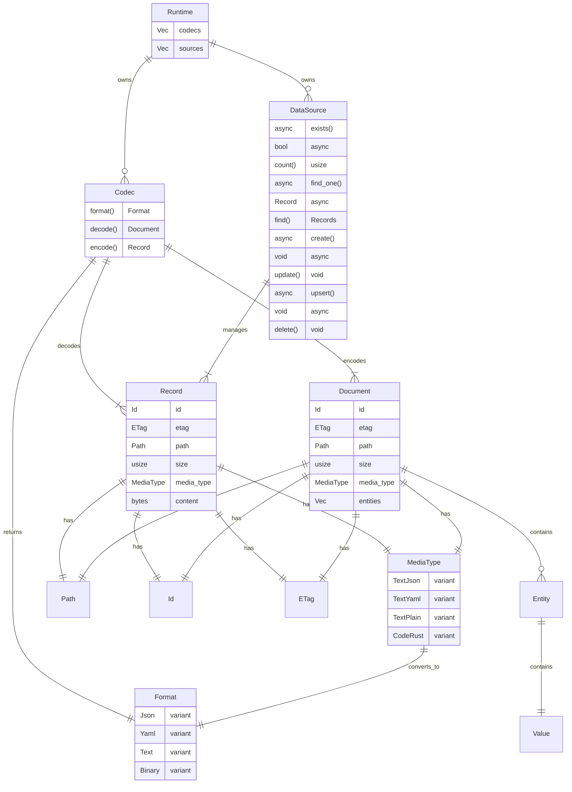

# loom-runtime

Core runtime library for Loom providing data source abstractions, codec transformations, and content type handling.

## Architecture



## Key Types

| Type | Description |
|------|-------------|
| **Runtime** | Top-level container holding codecs and data sources |
| **DataSource** | Async trait for storage backends (file system, memory, etc.) |
| **Codec** | Trait for encoding/decoding between Record and Document |
| **Record** | Raw bytes with metadata (storage layer) |
| **Document** | Parsed content with entities (application layer) |
| **MediaType** | Content type classification (78 variants) |
| **Format** | High-level format grouping (Json, Yaml, Text, Binary, etc.) |

## Data Flow

```
Read:  DataSource.find_one().await -> Record -> Codec.decode() -> Document
Write: Document -> Codec.encode() -> Record -> DataSource.create().await
```

## Usage

```rust
use loom_runtime::{Runtime, FileSystemSource, JsonCodec};

let runtime = Runtime::new()
    .codec(JsonCodec::new())
    .source(FileSystemSource::builder().build())
    .build();
```

### Load and Save

Convenience methods for typed deserialization/serialization:

```rust
use loom_runtime::{Runtime, FileSystemSource, JsonCodec, eval};
use loom_io::path::{Path, FilePath};
use loom_core::Format;

let runtime = Runtime::new()
    .source(FileSystemSource::builder().build())
    .codec(JsonCodec::new())
    .build();

// Load and deserialize
let path = Path::File(FilePath::from("data.json"));
let dataset: eval::SampleDataset = runtime.load("file_system", &path).await?;

// Serialize and save
runtime.save("file_system", &path, &dataset, Format::Json).await?;
```

## Evaluation Module

The `eval` module provides infrastructure for scoring and benchmarking:

```rust
use loom_runtime::eval::{SampleDataset, Sample, Decision};

// Load and validate a dataset
let dataset: SampleDataset = runtime.load("file_system", &path).await?;
let errors = dataset.validate();

// Types available:
// - SampleDataset, Sample - Dataset structures
// - Decision - Accept/Reject enum
// - Progress - Evaluation progress tracking
// - Scorer, AsyncScorer, BatchScorer - Scoring traits (from cortex)
// - PlattParams, train_platt_params - Platt calibration (from cortex)
```

## Signals

Runtime supports observability through signal emitters:

```rust
use loom_runtime::{Runtime, StdoutEmitter, FileEmitter};

let runtime = Runtime::new()
    .emitter(StdoutEmitter::new())
    .emitter(FileEmitter::new("logs/signals.log"))
    .build();

runtime.emit(signal);
```

## Navigation

[← Back to Libraries](../README.md)
