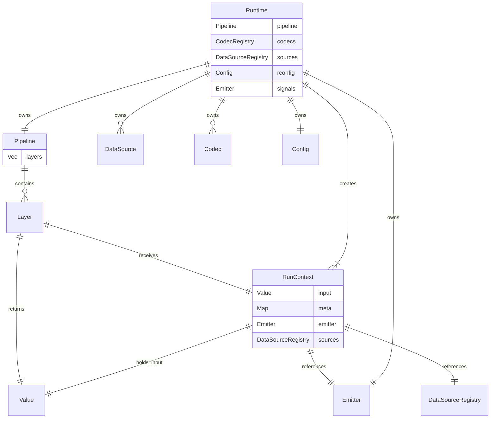

# loom-runtime

Core runtime library for Loom providing pipeline execution, data source abstractions, codec transformations, and signal emission.

## Architecture



## Key Types

| Type | Description |
|------|-------------|
| **Runtime** | Top-level container holding pipeline, codecs, data sources, config, and signal emitters |
| **Builder** | Fluent builder for constructing a Runtime with `.codec()`, `.source()`, `.config()`, `.layer()`, `.emitter()` |
| **RunContext** | Execution context implementing `LayerContext`; carries input value, metadata, emitter, and data sources |
| **Pipeline\<RunContext\>** | Ordered collection of layers executed in sequence |
| **DataSource** | Async trait for storage backends (file system, memory, etc.) |
| **Codec** | Trait for encoding/decoding between Record and Document |

## Execution Flow

```
Runtime.execute(input)
  -> RunContext::new(input, emitter, sources)
  -> for each layer:
       output = layer.process(&ctx)?
       ctx = ctx.next(output)
  -> return ctx.input().clone()
```

Each layer receives the current `RunContext` (which implements `LayerContext`) and returns a `Value`. The runtime threads values between layers by creating a new context with the output as the next input.

## Usage

### Building a Runtime

```rust
use loom_runtime::{Runtime, FileSystemSource, JsonCodec, StdoutEmitter};
use loom_config::Config;

let config = Config::new()
    .file("config.yaml")
    .env("LOOM_")
    .build()?;

let runtime = Runtime::new()
    .codec(JsonCodec::new())
    .source(FileSystemSource::builder().build())
    .config(config)
    .layer(eval_layer)         // any Layer<Input = RunContext>
    .emitter(StdoutEmitter::new())
    .build();
```

### Executing the Pipeline

```rust
use loom_core::value::Value;

let input = Value::String("some text to evaluate".to_string());
let result = runtime.execute(input)?;
```

### Load and Save

Convenience methods for typed deserialization/serialization:

```rust
use loom_core::Format;
use loom_io::path::Path;

// Load and deserialize
let dataset: SampleDataset = runtime.load("file_system", &path).await?;

// Serialize and save
runtime.save("file_system", &path, &result, Format::Json).await?;
```

## Signals

Runtime supports observability through signal emitters. Layers can emit signals via `ctx.emit(name, attrs)` on the `RunContext`:

```rust
use loom_runtime::{Runtime, StdoutEmitter, FileEmitter};

let runtime = Runtime::new()
    .emitter(StdoutEmitter::new())
    .emitter(FileEmitter::new("logs/signals.log"))
    .build();
```

## Navigation

[<- Back to Libraries](../README.md)
