# Hindsight Algorithm

A biomimetic agent memory system that organizes memories into epistemically-distinct networks and retrieves them using multi-pathway fusion.

## Overview

Hindsight structures agent memory like human cognition—separating facts from experiences, observations from opinions. The system uses the TEMPR (Temporal Entity Memory Priming Retrieval) architecture for storage and retrieval, and CARA (Coherent Adaptive Reasoning Agents) for preference-conditioned reasoning.

## Architecture

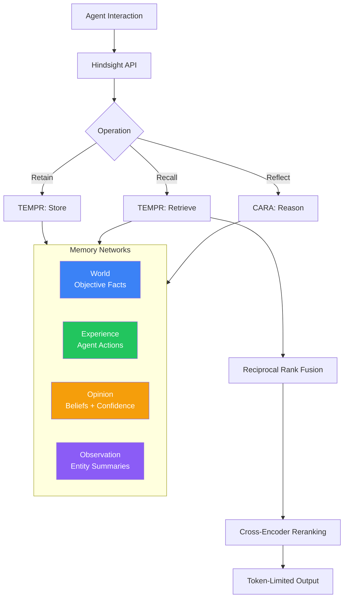

## Memory Networks

Hindsight organizes memories into four epistemically-distinct networks:

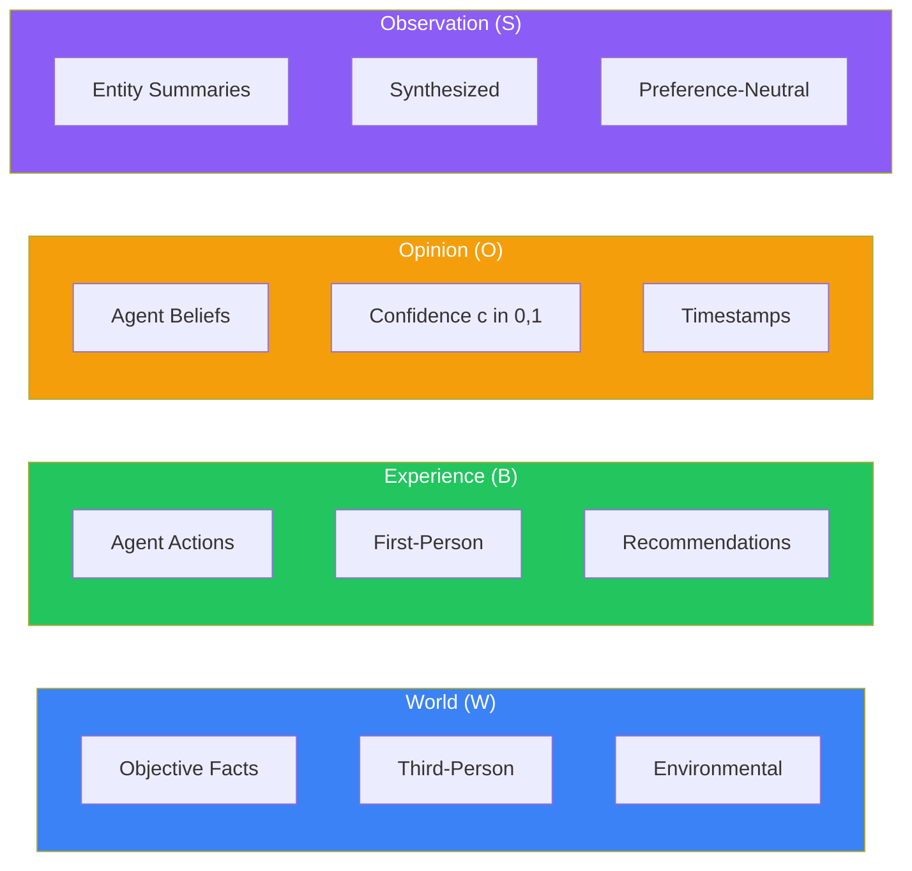

| Network | Symbol | Description | Example |
|---------|--------|-------------|---------|
| World | W | Objective, third-person environmental facts | "The stove gets hot when turned on" |
| Experience | B | First-person agent actions and outcomes | "I recommended the Italian restaurant and they loved it" |
| Opinion | O | Agent beliefs with confidence scores | "User prefers morning meetings (c=0.85)" |
| Observation | S | Synthesized entity profiles | "John: Software engineer, likes coffee, works remotely" |

## Core Operations

### Retain

Converts interactions into structured, time-aware memories.

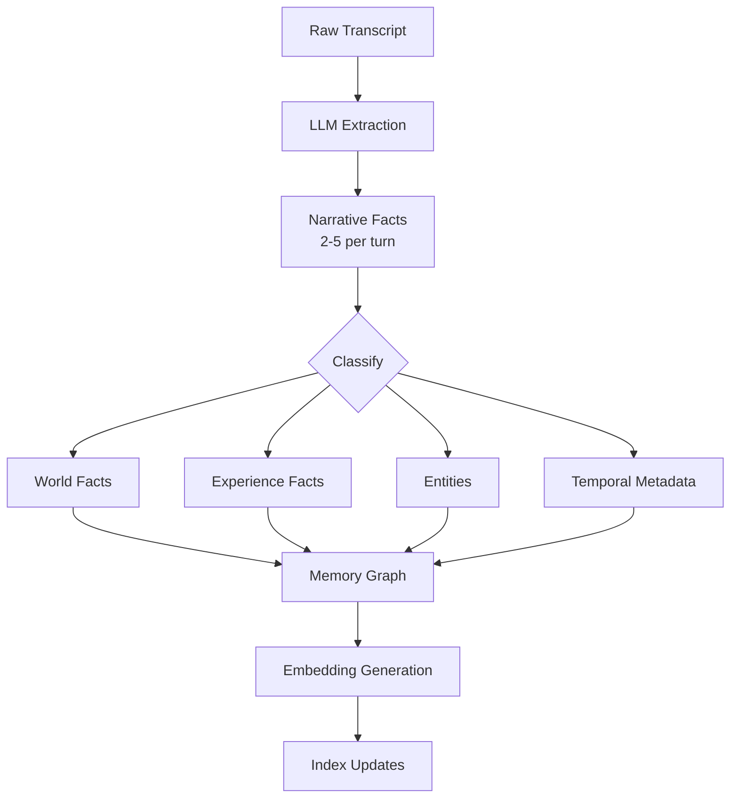

**Fact Representation:**

Each fact `f` contains:
- `u`: Unique identifier
- `b`: Bank identifier
- `t`: Narrative text
- `v ∈ ℝᵈ`: Embedding vector (d=384 default)
- `τ`: Temporal metadata (start/end timestamps)
- Entity links and type classifications

### Recall

Retrieves relevant memories using parallel multi-pathway search.

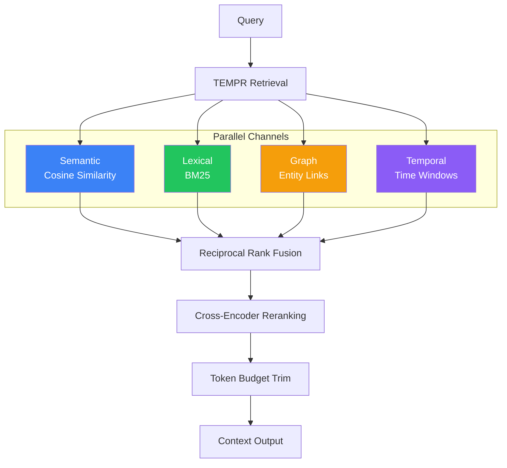

### Reflect

Performs deeper analysis and belief updating.

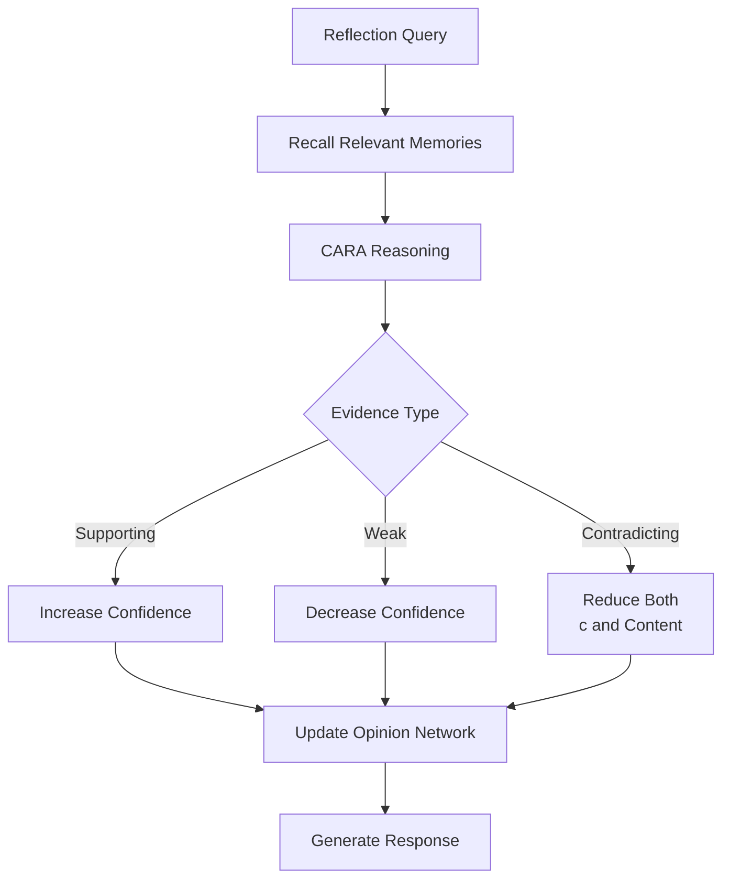

## TEMPR System

**T**emporal **E**ntity **M**emory **P**riming **R**etrieval

### Retrieval Channels

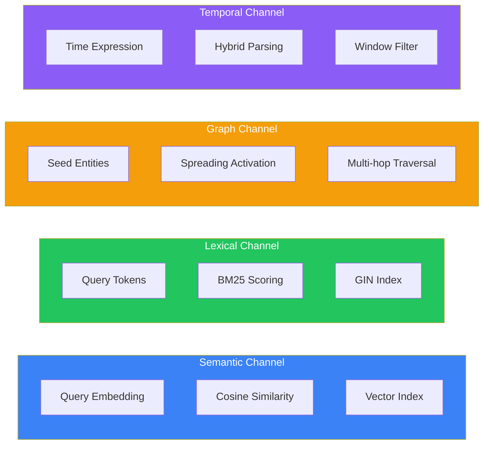

| Channel | Method | Index Type | Use Case |
|---------|--------|------------|----------|
| Semantic | Cosine similarity on embeddings | Vector (pgvector) | Conceptual similarity, paraphrasing |
| Lexical | BM25 ranking | GIN full-text | Names, technical terms, exact matches |
| Graph | Spreading activation | Entity links | Related entities, indirect connections |
| Temporal | Window filtering | B-tree timestamps | "Last spring", "yesterday", time ranges |

### Memory Graph

The memory graph `G = (V, E)` connects facts through multiple edge types:

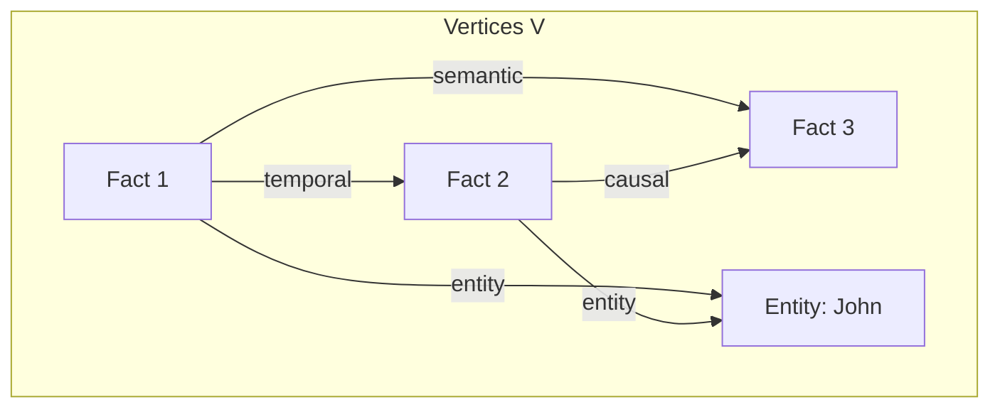

| Edge Type | Connection Criteria | Weight Function |
|-----------|---------------------|-----------------|
| Temporal | Close-in-time pairs | Time decay |
| Semantic | cosine(v₁, v₂) > θₛ | Similarity score |
| Entity | Shared entity reference | 1.0 (binary) |
| Causal | Extracted cause-effect | LLM confidence |

## Scoring & Fusion

### Reciprocal Rank Fusion (RRF)

Merges results from multiple retrieval channels without score normalization:

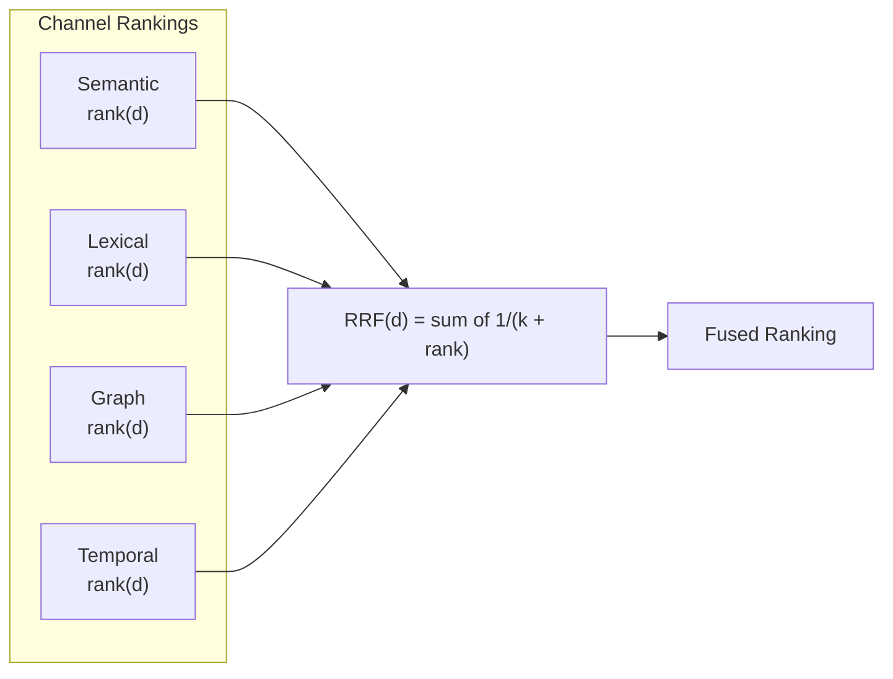

**Formula:**

```
RRF(d) = Σᵢ 1 / (k + rankᵢ(d))
```

Where:
- `d` = document/fact
- `k = 60` (regularization constant)
- `rankᵢ(d)` = position of d in channel i's results

**Why k = 60?**
- Balances weight between top-ranked and lower-ranked documents
- Prevents single-channel dominance
- Industry-standard value for production systems

### Cross-Encoder Reranking

After RRF fusion, a neural reranker refines the ordering:

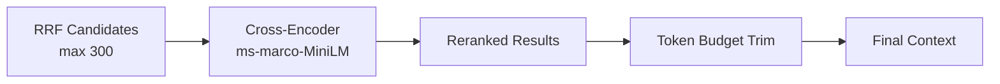

## CARA System

**C**oherent **A**daptive **R**easoning **A**gents

### Behavioral Profiles

Each agent has a profile `Θ = (S, L, E, β)`:

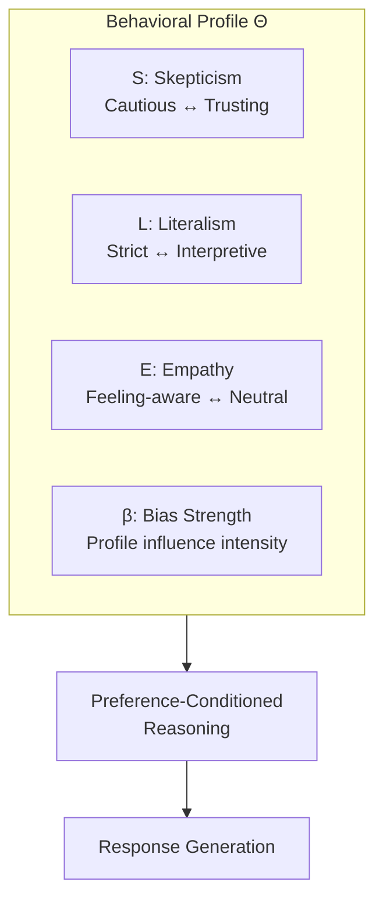

| Parameter | Low Value | High Value |
|-----------|-----------|------------|
| S (Skepticism) | Trusting, accepts claims | Cautious, requires evidence |
| L (Literalism) | Interpretive, infers intent | Strict, follows exactly |
| E (Empathy) | Neutral, task-focused | Feeling-aware, emotional |
| β (Bias) | Weak profile influence | Strong profile influence |

### Opinion Confidence Updates

Opinions maintain a confidence score `c ∈ [0, 1]` that updates with new evidence:

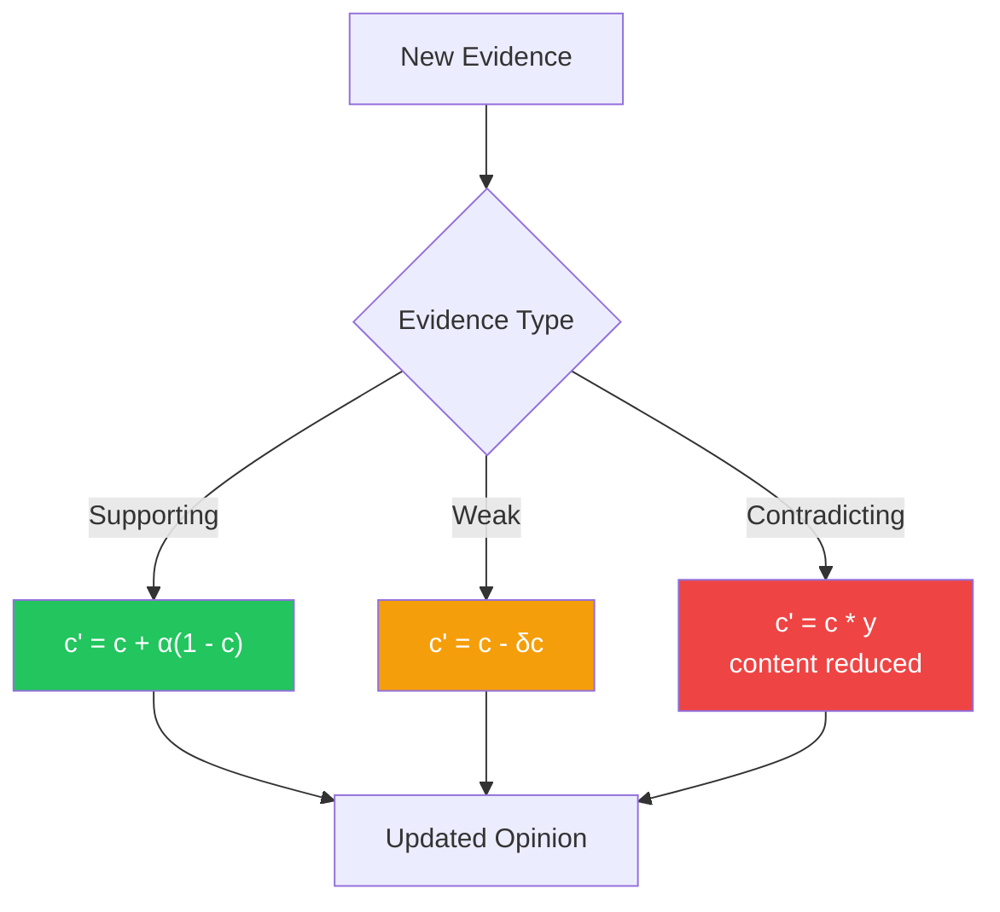

Where:
- `α` = learning rate for supporting evidence
- `δ` = decay rate for weak evidence
- `γ` = reduction factor for contradictions (γ < 1)

## Configuration Defaults

| Parameter | Default Value | Description |
|-----------|---------------|-------------|
| Embedding Model | BAAI/bge-small-en-v1.5 | Local embedding model |
| Embedding Dimensions | 384 | Vector size |
| Reranker | cross-encoder/ms-marco-MiniLM-L-6-v2 | Neural reranking model |
| Max Reranker Candidates | 300 | Pre-filter limit |
| RRF Constant k | 60 | Rank fusion regularization |
| Graph Retriever | link_expansion | Traversal algorithm |
| MPFP Top-K Neighbors | 20 | Graph expansion limit |
| Recall Connection Budget | 4 | Max concurrent retrievals |
| Recall Max Concurrent | 32 | Global concurrency limit |
| Retain Chunk Size | 3000 chars | Text chunking |
| Reflect Max Iterations | 10 | Tool call limit |

## Retrieval Priority

During reflection, memory tiers are prioritized:


## Performance

> **Caveat:** These scores are self-reported by Hindsight's creators and not independently peer-reviewed.

| Benchmark | Claimed Score | Comparison |
|-----------|---------------|------------|
| LongMemEval | 91.4% | vs. 39% baseline (self-reported) |
| LoCoMo | 89.61% | vs. GPT-4o full-context (self-reported) |

## Sources

- [GitHub Repository](https://github.com/vectorize-io/hindsight)
- [Research Paper (arXiv:2512.12818)](https://arxiv.org/abs/2512.12818)
- [Official Documentation](https://hindsight.vectorize.io/)
