# Hindsight Scoring & Evaluation

How Hindsight scores, ranks, and evaluates memories during retrieval.

## Scoring Pipeline

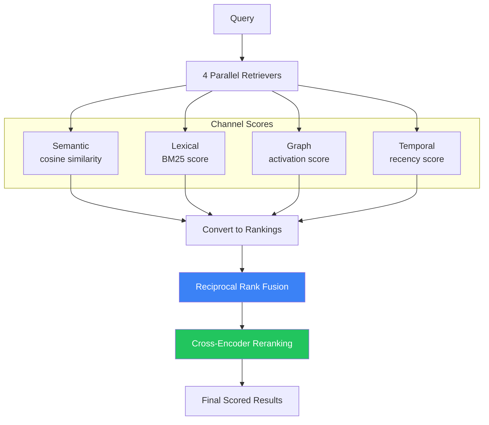

## Channel Scoring

### 1. Semantic Scoring

Measures conceptual similarity using embedding vectors.

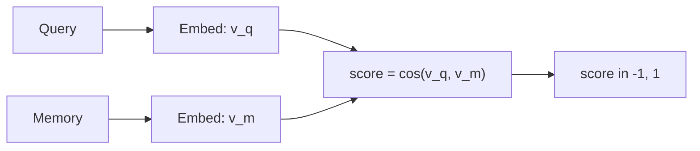

**Formula:**

```
semantic_score(q, m) = (v_q · v_m) / (||v_q|| × ||v_m||)
```

Where:
- `v_q` = query embedding vector (ℝ³⁸⁴)
- `v_m` = memory embedding vector (ℝ³⁸⁴)

### 2. Lexical Scoring (BM25)

Measures term-based relevance using Okapi BM25.

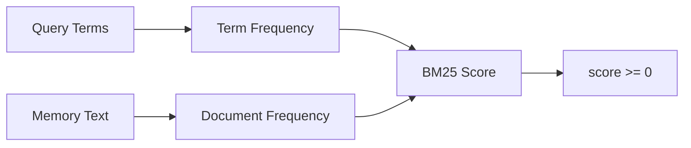

**Formula:**

```
BM25(q, m) = Σ IDF(t) × (f(t,m) × (k₁ + 1)) / (f(t,m) + k₁ × (1 - b + b × |m|/avgdl))
```

Where:
- `t` = query term
- `f(t,m)` = term frequency in memory m
- `|m|` = memory length
- `avgdl` = average document length
- `k₁ = 1.2`, `b = 0.75` (standard parameters)

### 3. Graph Scoring

Spreading activation across memory graph edges.

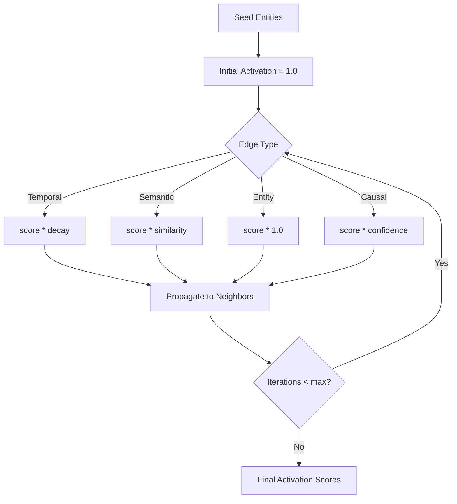

**Activation Decay:**

```
activation(n, t+1) = Σ activation(m, t) × edge_weight(m, n) × damping
```

Where `damping = 0.85` (prevents infinite propagation)

### 4. Temporal Scoring

Filters and scores by time relevance.

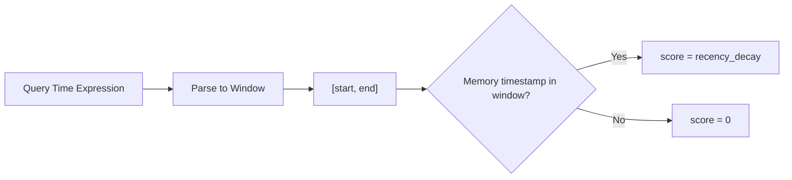

**Recency Decay:**

```
temporal_score(m) = e^(-λ × age(m))
```

Where:
- `λ` = decay rate
- `age(m)` = time since memory creation

## Reciprocal Rank Fusion (RRF)

Combines rankings from all channels without score normalization.

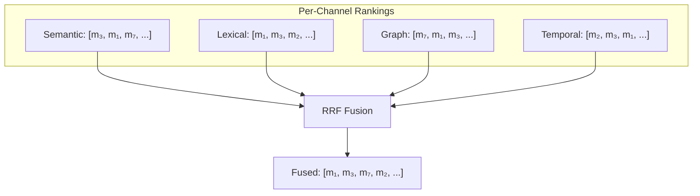

**Formula:**

```
RRF(m) = Σᵢ 1 / (k + rankᵢ(m))
```

**Example Calculation:**

For memory `m₁` with ranks: Semantic=2, Lexical=1, Graph=2, Temporal=3

```
RRF(m₁) = 1/(60+2) + 1/(60+1) + 1/(60+2) + 1/(60+3)
        = 1/62 + 1/61 + 1/62 + 1/63
        = 0.0161 + 0.0164 + 0.0161 + 0.0159
        = 0.0645
```

**Why k = 60?**

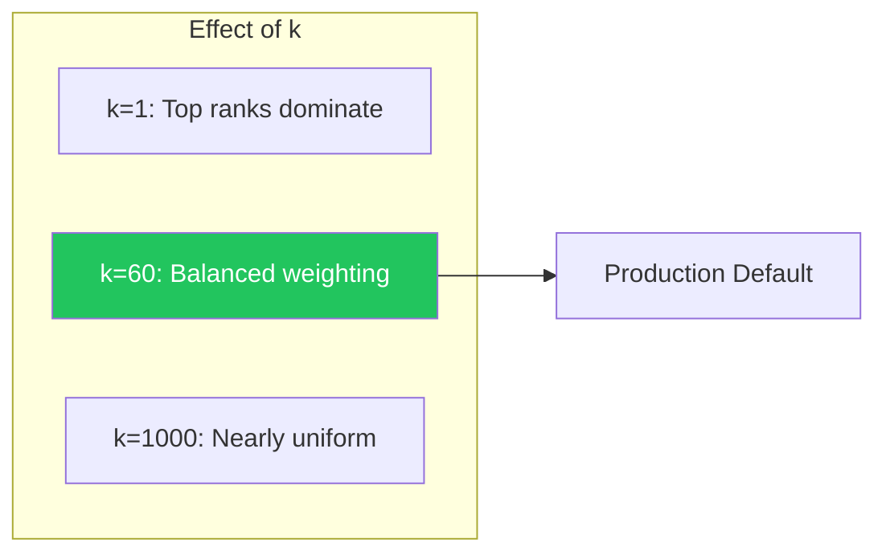

| k Value | Behavior | Use Case |
|---------|----------|----------|
| Small (1-10) | Top-1 dominates | High precision needed |
| Medium (60) | Balanced | General retrieval |
| Large (100+) | Flattened ranks | Diversity prioritized |

## Cross-Encoder Reranking

Neural reranker scores query-memory pairs directly.

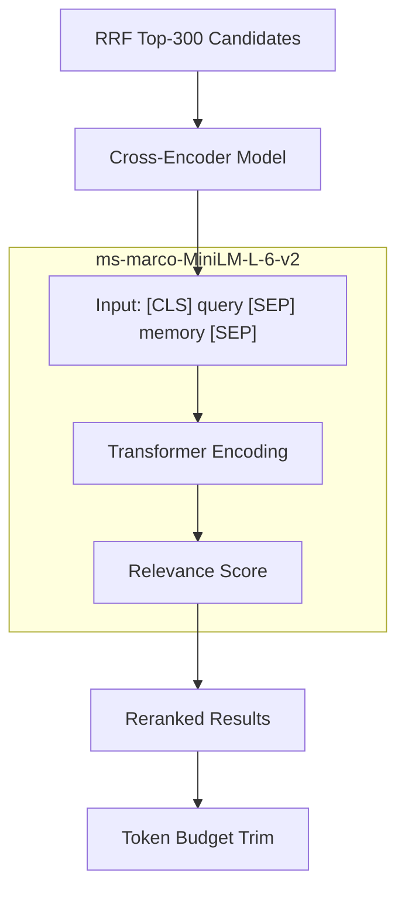

**Scoring:**

```
rerank_score(q, m) = sigmoid(model([CLS] q [SEP] m [SEP]))
```

Output: `score ∈ [0, 1]` representing relevance probability

**Configuration:**

| Parameter | Default | Description |
|-----------|---------|-------------|
| Max Candidates | 300 | Pre-filter before reranking |
| Max Concurrent | 4 | Prevent CPU thrashing |
| Batch Size | 128 | TEI batching |

## Opinion Confidence Scoring

Beliefs maintain confidence scores that update with evidence.

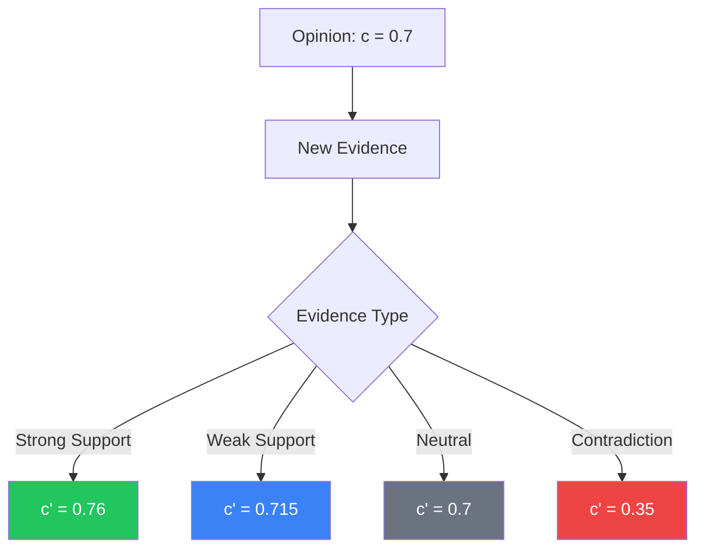

**Update Rules:**

| Evidence | Formula | Effect |
|----------|---------|--------|
| Strong support | `c' = c + α(1 - c)` | Approaches 1.0 |
| Weak support | `c' = c + α'(1 - c)` | Slow increase |
| Contradiction | `c' = c × γ` | Multiplicative decay |
| Strong contradiction | Content also reduced | Opinion weakened |

Where:
- `α` = learning rate (strong) ≈ 0.2
- `α'` = learning rate (weak) ≈ 0.05
- `γ` = contradiction decay ≈ 0.5

## Evaluation Benchmarks

> **Caveat:** These scores are self-reported by Hindsight's creators and have not been independently peer-reviewed. The benchmark methodology was also designed by the same team. Treat these numbers as claims, not verified facts.

### LongMemEval

Tests long-term memory across conversational AI scenarios.

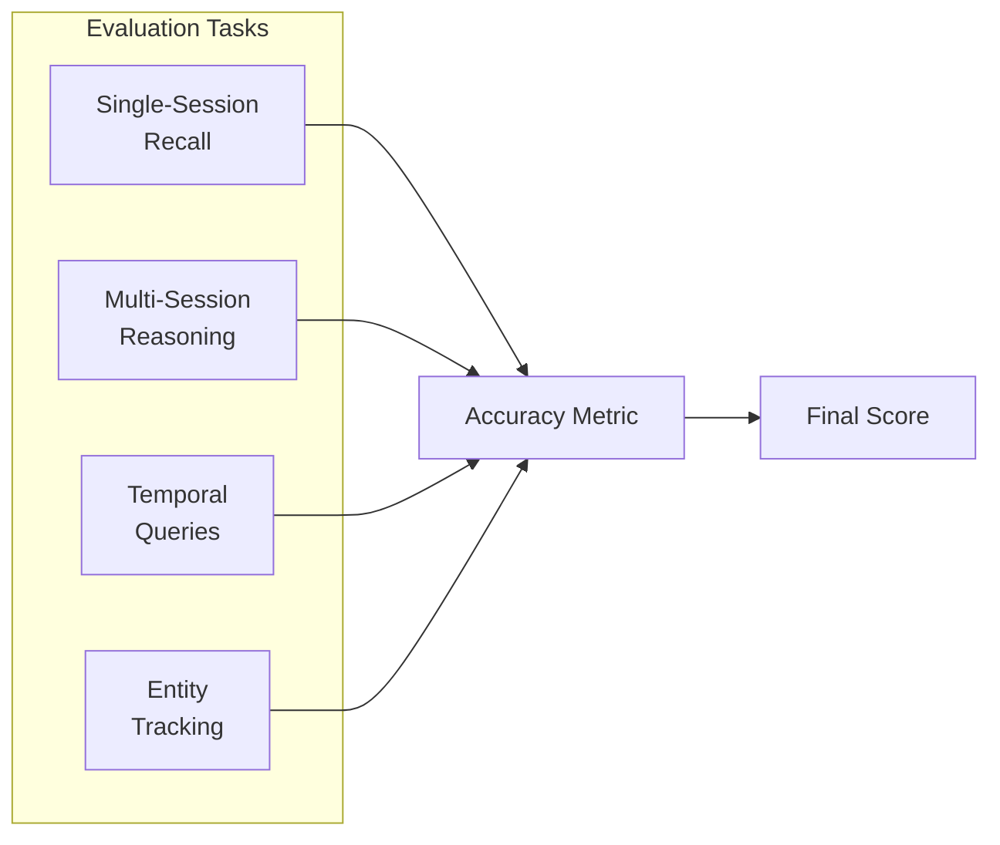

**Claimed Results (unverified):**

| System | Accuracy |
|--------|----------|
| Baseline (RAG) | 39% |
| Hindsight (20B) | 83.6% |
| Hindsight (Gemini-3) | 91.4% |

### LoCoMo

Tests long-context conversation modeling.

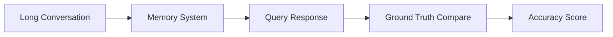

**Claimed Results (unverified):**

| System | Accuracy |
|--------|----------|
| GPT-4o (full context) | 85.2% |
| Hindsight | 89.61% |

## Scoring Summary

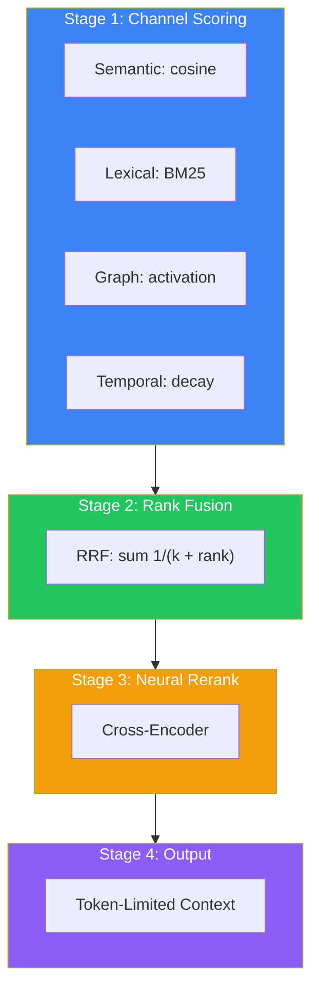

| Stage | Method | Output |
|-------|--------|--------|
| 1. Channel Scoring | Cosine, BM25, Activation, Decay | Raw scores per channel |
| 2. Rank Fusion | RRF (k=60) | Unified ranking |
| 3. Neural Rerank | Cross-encoder | Refined ranking |
| 4. Output | Token budget trim | Final context |
