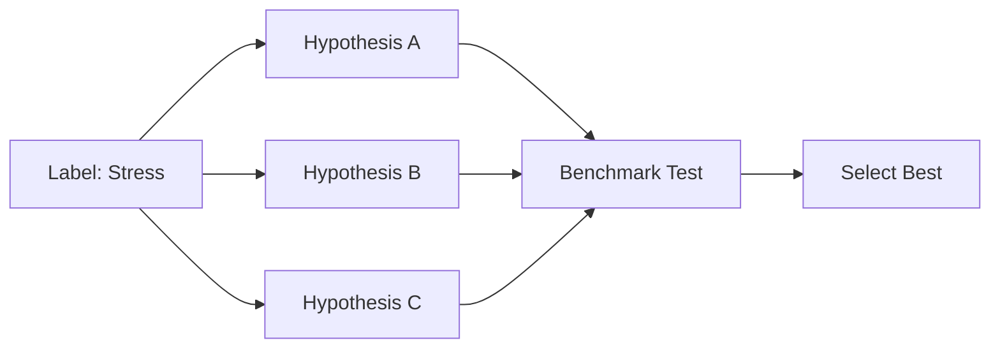
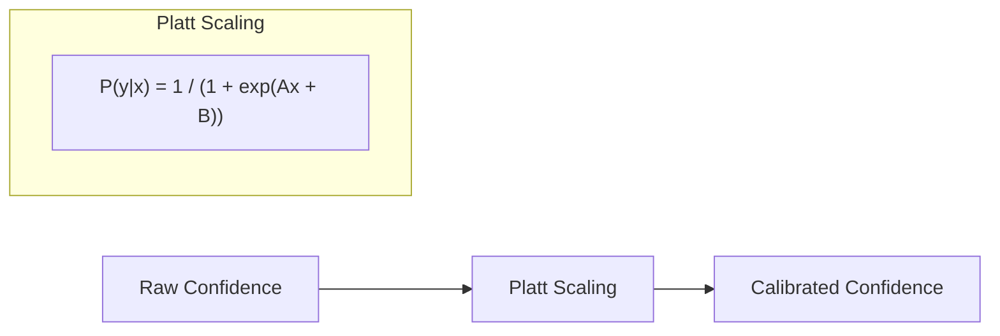
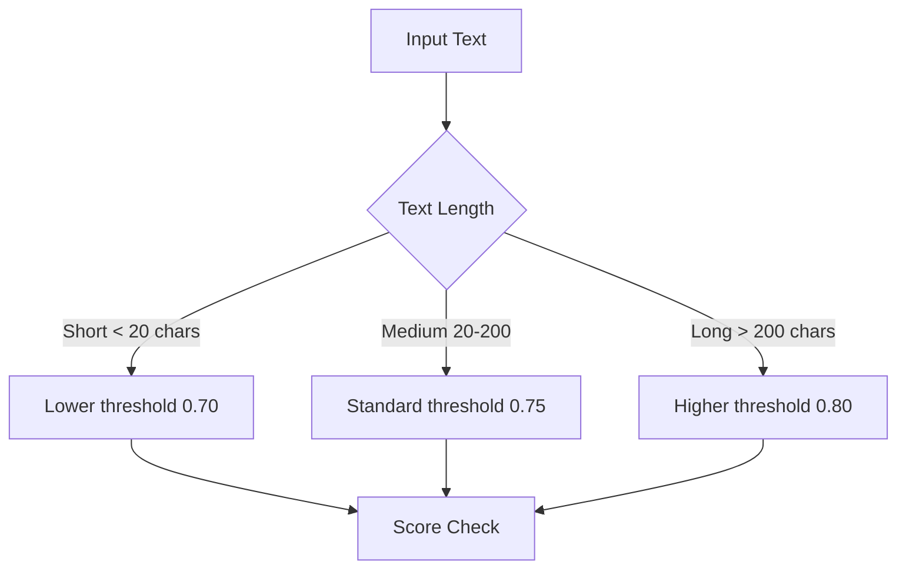

# Phase 1: Foundation

Quick wins with **zero latency cost**. These improvements can be deployed immediately without impacting performance.

<pre>
├── <a href="./README.md">&lt;&lt;merc&gt;&gt;</a>
├── <a href="./scoring-algorithm.md">Scoring Algorithm</a>
├── <a href="./1.foundation.md"><b>1. Foundation</b></a> 👈
├── <a href="./2.labels.md">2. Label Expansion</a>
├── <a href="./3.context.md">3. Context & Ensemble</a>
├── <a href="./4.learning.md">4. Learning Infrastructure</a>
└── <a href="./5.output.md">5. Output Enrichment</a>
</pre>

---

## Overview

| ID | Task | Latency Impact | Expected Gain |
|----|------|----------------|---------------|
| MERC-001 | Hypothesis Optimization | 0% | 5-15% |
| MERC-002 | Platt Calibration | <1% | 10-20% |
| MERC-003 | Dynamic Thresholds | 0% | 5-10% |

**Combined potential:** 20-35% accuracy improvement with zero latency cost.

---

## MERC-001: Hypothesis Optimization

**Status:** 🔲 Not Started

### Problem

Zero-shot classification is sensitive to hypothesis phrasing. The same label can score very differently based on how the hypothesis is worded.

### Current State

```rust
// Single hypothesis per label
fn hypothesis(&self) -> &str {
    "This text expresses stress or pressure."
}
```

### Solution

Benchmark multiple hypothesis phrasings and use the best-performing ones.



### Implementation

```rust
// After: validated hypothesis (tested on benchmark, this phrasing scores 12% higher)
fn hypothesis(&self) -> &str {
    "The speaker is feeling stressed, overwhelmed, or under pressure."
}
```

### Files

- `src/score/label.rs` — `hypothesis()` methods (lines 192-472)

### Tasks

- [ ] Create benchmark dataset (100+ labeled samples)
- [ ] Test 3-5 hypothesis variations per label
- [ ] Update `hypothesis()` methods with best phrasings
- [ ] Document phrasing decisions

### Acceptance Criteria

- Each label benchmarked
- 5-15% improvement on test set
- Zero runtime cost (compile-time change)

---

## MERC-002: Platt Calibration

**Status:** 🔲 Not Started

### Problem

Zero-shot models often produce overconfident or underconfident scores. Raw confidence values don't map linearly to true probabilities.

### Solution

Apply [Platt scaling](https://en.wikipedia.org/wiki/Platt_scaling) to calibrate confidence scores.



### Implementation

```rust
struct CalibratedLabel {
    label: Label,
    // Learned from validation set
    platt_a: f32,
    platt_b: f32,
}

impl CalibratedLabel {
    fn calibrate(&self, raw_score: f32) -> f32 {
        1.0 / (1.0 + (-self.platt_a * raw_score - self.platt_b).exp())
    }
}
```

### Files

- `src/score/label.rs` — Add calibration params
- `src/score/result.rs` — Modify `ScoreLabel::with_score()` (line 132)

### Tasks

- [ ] Add `platt_a`, `platt_b` params to labels
- [ ] Create `calibrate(raw: f32) -> f32` function
- [ ] Train params on validation set
- [ ] Add unit tests

### Acceptance Criteria

- <1ms latency increase
- 10-20% reduction in false positives/negatives

### Research Context

This approach mirrors **Hindsight's opinion confidence tracking**—both systems recognize that raw model outputs need calibration to be useful for decision-making.

---

## MERC-003: Dynamic Thresholds

**Status:** 🔲 Not Started

### Problem

Static 0.75 threshold doesn't adapt to content characteristics. Short text may be penalized unfairly; long text may pass too easily.

### Solution

Adjust thresholds based on input characteristics.



### Implementation

```rust
fn dynamic_threshold(text: &str, base: f32) -> f32 {
    let len = text.len();
    match len {
        0..=20 => base - 0.05,    // Short text: lower bar
        21..=200 => base,          // Normal
        _ => base + 0.05,          // Long text: higher bar
    }
}
```

### Files

- `src/score/mod.rs` — Modify `invoke()` (line 34)
- `src/score/options.rs` — Add config option

### Tasks

- [ ] Add `dynamic_threshold: bool` to `ScoreOptions`
- [ ] Create `compute_threshold(text, base) -> f32`
- [ ] Short text (<20 chars): threshold - 0.05
- [ ] Long text (>200 chars): threshold + 0.05
- [ ] Add tests

### Acceptance Criteria

- Configurable via options
- No latency impact
- 5-10% better precision

---

## Testing Requirements

- [ ] Benchmark dataset (100+ labeled samples)
- [ ] Latency benchmarks before/after
- [ ] Accuracy benchmarks before/after
- [ ] Unit tests for each improvement

---

## Next Phase

After completing Phase 1, proceed to [Phase 2: Label Expansion](./2.labels.md) for expanded label taxonomy (+16 labels).
