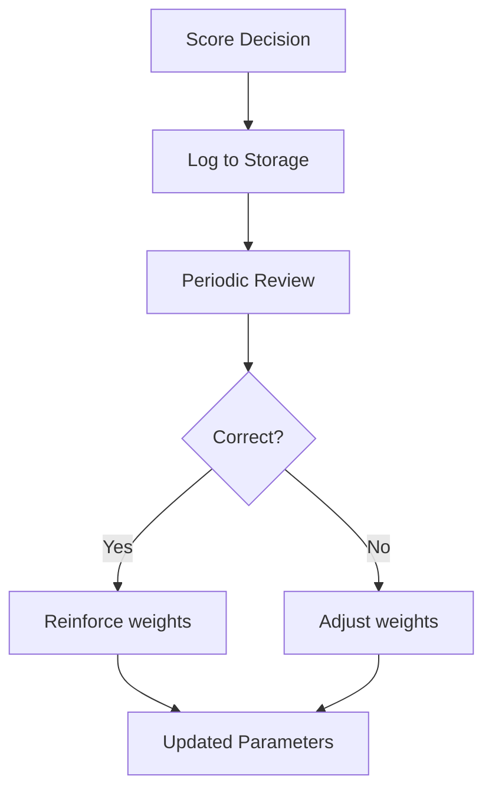
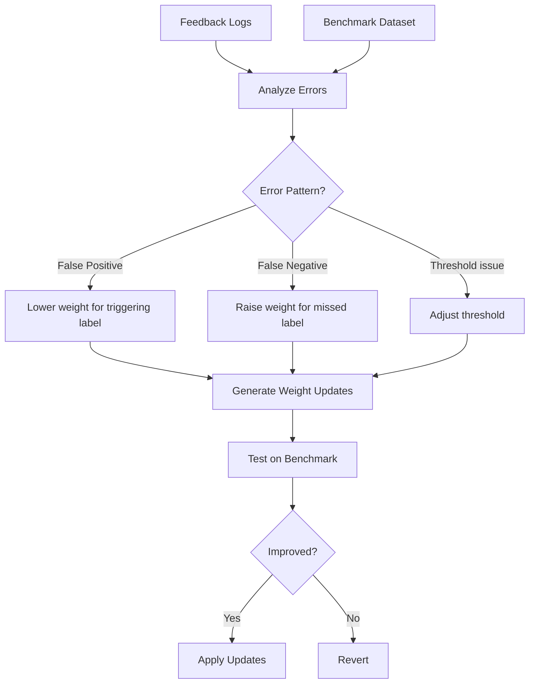
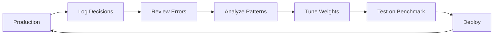

# Phase 4: Learning Infrastructure

Build feedback loops for continuous improvement. **Zero runtime latency impact**.

<pre>
├── <a href="./README.md">&lt;&lt;merc&gt;&gt;</a>
├── <a href="./scoring-algorithm.md">Scoring Algorithm</a>
├── <a href="./1.foundation.md">1. Foundation</a>
├── <a href="./2.labels.md">2. Label Expansion</a>
├── <a href="./3.context.md">3. Context & Ensemble</a>
├── <a href="./4.learning.md"><b>4. Learning Infrastructure</b></a> 👈
└── <a href="./5.output.md">5. Output Enrichment</a>
</pre>

---

## Overview

| ID | Task | Runtime Impact | Purpose |
|----|------|----------------|---------|
| MERC-010 | Feedback Logging | <1ms | Capture decisions for review |
| MERC-011 | Benchmark Dataset | 0% | Measure accuracy |
| MERC-012 | Weight Tuning Pipeline | 0% | Continuous improvement |

**Goal:** Enable data-driven weight tuning without impacting runtime performance.

---

## MERC-010: Feedback Logging

**Status:** 🔲 Not Started

### Problem

No mechanism to learn from mistakes. The same errors repeat without any visibility into patterns.

### Solution

Log scoring decisions for periodic review and weight tuning.



### Implementation

```rust
use chrono::{DateTime, Utc};
use uuid::Uuid;

#[derive(Debug, Clone, Serialize, Deserialize)]
pub struct FeedbackLog {
    pub id: Uuid,
    pub text: String,
    pub context: Option<String>,
    pub score: f32,
    pub label_scores: Vec<LabelScore>,
    pub decision: Decision,
    pub confidence: Confidence,
    pub timestamp: DateTime<Utc>,
    // Added later by review
    pub correct: Option<bool>,
    pub notes: Option<String>,
}

#[derive(Debug, Clone, Serialize, Deserialize)]
pub enum Decision {
    Accept,
    Reject,
}
```

### Storage Options

| Option | Pros | Cons |
|--------|------|------|
| File (JSON/CSV) | Simple, portable | No querying |
| SQLite | Local, queryable | Single process |
| PostgreSQL | Scalable, queryable | Requires setup |

MVP: File-based storage (JSON lines)

```rust
pub trait FeedbackStore {
    fn log(&self, entry: FeedbackLog) -> Result<()>;
    fn get_unlabeled(&self) -> Result<Vec<FeedbackLog>>;
    fn mark_correct(&self, id: Uuid, correct: bool) -> Result<()>;
}

// File-based implementation
pub struct JsonLinesStore {
    path: PathBuf,
}
```

### Files

- `src/score/feedback.rs` (new)
- `src/score/mod.rs` — Add logging call

### Tasks

- [ ] Create `FeedbackLog` struct
- [ ] Create `FeedbackStore` trait
- [ ] Implement `JsonLinesStore` (MVP)
- [ ] Add logging to scoring pipeline
- [ ] Create CLI for reviewing logs

### Acceptance Criteria

- Decisions logged with <1ms overhead
- Pluggable storage backend
- Review workflow documented

---

## MERC-011: Benchmark Dataset

**Status:** 🔲 Not Started

### Problem

No standardized way to measure accuracy changes. Improvements are "felt" rather than measured.

### Solution

Create a curated benchmark dataset with ground-truth labels.

### Dataset Structure

```json
{
  "samples": [
    {
      "id": "bench-001",
      "text": "I'll have the report done by Friday",
      "context": "Can you help me with the project?",
      "expected_decision": "accept",
      "expected_labels": ["Commitment", "Task", "Time"],
      "category": "commitment",
      "difficulty": "easy"
    },
    {
      "id": "bench-002",
      "text": "Got it, thanks",
      "context": null,
      "expected_decision": "reject",
      "expected_labels": ["Acknowledgment", "Phatic"],
      "category": "phatic",
      "difficulty": "easy"
    }
  ]
}
```

### Categories

| Category | Examples | Target Count |
|----------|----------|--------------|
| Commitment | "I'll do X by Y" | 50 |
| Task | "Remember to X" | 50 |
| Emotional | "I'm stressed about X" | 50 |
| Factual | "X happened" | 50 |
| Phatic | "Hi", "Thanks" | 50 |
| Ambiguous | Edge cases | 50 |
| Context-dependent | Follow-ups | 50 |
| **Total** | | **350+** |

### Benchmark Script

```rust
fn run_benchmark(dataset: &Dataset) -> BenchmarkResult {
    let mut results = Vec::new();

    for sample in &dataset.samples {
        let score_result = score(&sample.text, sample.context.as_deref());
        let actual_decision = if score_result.accepted() { "accept" } else { "reject" };

        results.push(SampleResult {
            id: sample.id.clone(),
            expected: sample.expected_decision.clone(),
            actual: actual_decision.to_string(),
            correct: actual_decision == sample.expected_decision,
            score: score_result.score,
        });
    }

    BenchmarkResult::from_results(results)
}
```

### Files

- `benches/benchmark_dataset.json` (new)
- `benches/accuracy.rs` (new)

### Tasks

- [ ] Create dataset schema
- [ ] Collect 350+ labeled samples
- [ ] Write benchmark runner
- [ ] Add to CI pipeline
- [ ] Track accuracy over time

### Acceptance Criteria

- 350+ labeled samples
- Automated benchmark runner
- Accuracy tracked in CI

---

## MERC-012: Weight Tuning Pipeline

**Status:** 🔲 Not Started

### Problem

Weights are hand-tuned based on intuition. No systematic way to optimize.

### Solution

Use feedback logs and benchmark data to tune weights.



### Analysis Script

```rust
fn analyze_errors(logs: &[FeedbackLog], benchmark: &Dataset) -> WeightRecommendations {
    let false_positives = logs.iter()
        .filter(|l| l.decision == Decision::Accept && l.correct == Some(false))
        .collect::<Vec<_>>();

    let false_negatives = logs.iter()
        .filter(|l| l.decision == Decision::Reject && l.correct == Some(false))
        .collect::<Vec<_>>();

    // Find patterns in errors
    let fp_patterns = find_common_labels(&false_positives);
    let fn_patterns = find_common_labels(&false_negatives);

    WeightRecommendations {
        decrease: fp_patterns,  // Labels causing false positives
        increase: fn_patterns,  // Labels missing from false negatives
    }
}
```

### Tuning Process

1. **Collect feedback** — Run in production, label errors
2. **Analyze patterns** — Find common labels in errors
3. **Generate recommendations** — Suggest weight changes
4. **Test on benchmark** — Verify improvement
5. **Deploy** — Update weights in config

### Files

- `tools/tune_weights.rs` (new)
- `config/weights.toml` — Externalize weights

### Tasks

- [ ] Externalize weights to config file
- [ ] Create analysis script
- [ ] Create tuning CLI
- [ ] Document tuning process
- [ ] Add safeguards (max adjustment per iteration)

### Acceptance Criteria

- Weights in external config (not code)
- Analysis script identifies error patterns
- Documented tuning workflow

---

## Research Context

### How Other Systems Learn

| System | Learning Approach |
|--------|-------------------|
| Merc (proposed) | Feedback logs → weight tuning |
| Zep | No explicit learning (relies on LLM) |
| Hindsight | Opinion confidence updates with evidence |
| Enterprise Model | No explicit learning (fixed BERT) |

**Hindsight's CARA system** updates opinion confidence based on evidence:
- Strong support: `c' = c + α(1 - c)`
- Contradiction: `c' = c × γ`

Merc's approach is simpler—tune static weights based on observed errors—but achieves a similar goal of continuous improvement.

---

## Workflow Summary



---

## Testing Requirements

- [ ] Unit tests for logging
- [ ] Benchmark runner tests
- [ ] Weight tuning safeguards
- [ ] CI integration for benchmarks

---

## Next Phase

After completing Phase 4, proceed to [Phase 5: Output Enrichment](./5.output.md) for structured output format and downstream integration.
